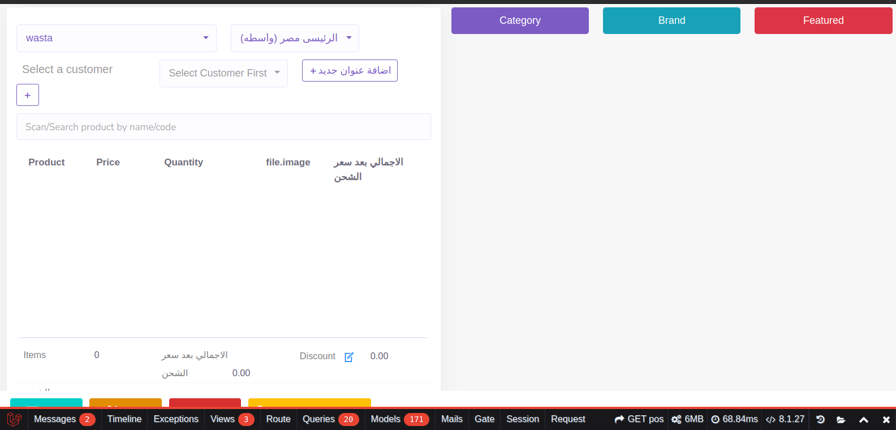

# Full Stack Developer Assessment

Thank you for the opportunity to participate in the assessment for the Full Stack Developer position. Below are the details of my investigation, findings, and solutions for the given tasks.

## Output



## Task Commit Changes

You can track the progress and changes made for this task by referring to the commits in the following repository:

[Task Commit Changes](https://github.com/MostafaSewidan/wastaTechnicalAssessment/commit/347280080ccf0a5f4b77a6b4c3e46fc76f63f4d3)

## First Task: Investigation and Resolution

### Objective
Investigate and resolve the prolonged loading times on the POS page (/pos) of the ERP system.

### Steps to Solve

1. **Investigate the POS Page Loading Issue:**
   - **Profiling and Monitoring:** Utilized Chrome DevTools, laravel debugbar and web performance monitoring tools to identify slow-loading elements.
   - **Database Query Analysis:** Checked the queries being run on the POS page for inefficiencies.
   - **Backend Performance:** Analyzed backend code for inefficient loops and heavy computations.

2. **Identify the Root Cause:**
   - **Database Issues:** Identified long-running queries.
   - **Front-end Issues:** Detected large assets and blocking scripts.
   - **Backend Issues:** Found inefficient code.

3. **Develop a Plan:**
   - **Optimize Queries:** Used EXPLAIN plans to optimize SQL queries .
   - **Code Refactoring:** Refactored inefficient backend code.
   - **Asset Optimization:** Compressed images, used lazy loading, and minified CSS/JS files.

4. **Implement Changes:**
   - **Database:** optimized queries.
   - **Backend:** Refactored code for better performance.
   - **Front-end:** Optimized assets and ensured non-blocking scripts.


## Second Task: Further Investigation and Enhancement


After Conduct a comprehensive review of the POS page. l have Proposed enhancements to improve the POS page's functionality and user experience..

### 1. Database design
We can make the project faster with some modifications to the database

**Example of proposed Solutions:** 
 
  in  `places table` we can create a states table to separate the states from the palces `places BelongsTo states`.
  

### 2. Code enhancement
We have found some problems that you can work on to improve the code, we can solve these problems by applying the principles of solid principles.

- we can use the `HMVC pattern` to simplify the files and folder structure
- we can use the laravel components in `blades files` to make the code more modular and reusable code.
- we can rebuild the `/POS` page using VueJs it will make it more responsive and dynamic. By leveraging Vue.js, we can enhance user experience with real-time updates and interactive elements. This approach enables seamless integration of front-end and back-end functionalities, resulting in a more efficient and intuitive POS system. Additionally, Vue.js simplifies code organization and maintenance, making future updates and modifications easier to implement.

#### also we found a  problems with using a roles and permissions

In our current permissions cycle, we can significantly improve efficiency and flexibility by adopting the Spatie permissions package. This approach leverages the `model_has_roles` table instead of using a single `role_id` column in the `users` table. Additionally, we can benefit from Spatie's caching features to optimize performance. Here are the key benefits and enhancements:

### Benefits of Using Spatie's Structure
1. **Flexibility in Role Assignment:**
   - **Multiple Roles per User:** The `model_has_roles` table allows assigning multiple roles to a single user, offering greater flexibility compared to a single `role_id` column.
   
2. **Enhanced Code Efficiency:**
   - **Common Middleware:** By using Spatie's structure, we can streamline and enhance the common middleware code, leading to more maintainable and readable code.

3. **Advanced Permission Checking:**
   - **Directives and Methods:** Spatie provides a rich set of directives and methods for checking roles and permissions, which simplifies and strengthens our authorization logic.

### Benefits of Spatie's Caching Features

1. **Improved Performance:**
   - **Permission Caching:** Spatie allows caching of permissions and roles, which reduces the number of database queries and speeds up permission checks.

2. **Reduced Load:**
   - **Efficient Caching Mechanism:** By caching roles and permissions, we reduce the load on the database, improving overall application performance.

### Implementation Overview

1. **Database Structure:**
   - **Current Approach:** The `users` table has a `role_id` column.
   - **Proposed Approach:** Use the `model_has_roles` table provided by Spatie, which allows mapping multiple roles to users.

2. **Middleware Enhancements:**
   - Refactor existing middleware to utilize Spatie's role and permission checking methods, reducing complexity and improving clarity.

3. **Role and Permission Checks:**
   - Use Spatie's built-in directives and methods for checking roles and permissions within controllers, views, and other parts of the application.

4. **Implementing Caching:**
   - Enable Spatie's caching features to store roles and permissions, ensuring faster access and reduced database queries.

### Example of Role Assignment, Checking, and Caching

1. **Assigning Roles:**
   ```php
   // Assigning a role to a user
   $user->assignRole('admin');

   // Assigning multiple roles to a user
   $user->assignRole(['editor', 'moderator']);

1. **Checking Roles:**
   ```php
   // Checking if a user has a specific role
    if ($user->hasRole('admin')) {
        // User has the admin role
    }

    // Checking if a user has any of the given roles
    if ($user->hasAnyRole(['editor', 'moderator'])) {
        // User has either editor or moderator role
    }

1. **Enabling Caching:**
   ```php
   // Enable caching of roles and permissions
    Spatie\Permission\PermissionRegistrar::class->forgetCachedPermissions();
